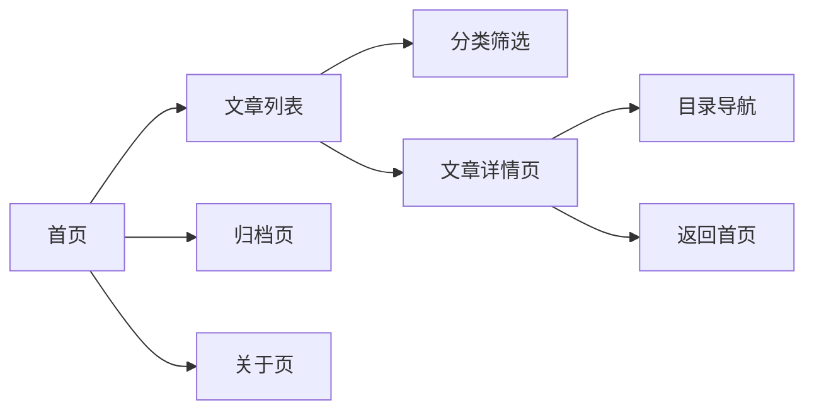

## 1. 产品概述

一个面向开发者的个人博客网站，以 GitHub 美学为灵感，提供文章阅读、技术分享和个人展示功能。目标是打造一个兼具技术质感与阅读体验的个人品牌展示平台。

- 主要用途：个人技术文章发布、项目展示、个人简介
- 目标用户：开发者、技术爱好者、潜在合作伙伴
- 核心价值：高质量内容输出 + 专业个人形象塑造

## 2. 核心功能

### 2.1 功能模块

1. **首页**：Hero 区域、最新文章列表、分类标签、个人简介卡片
2. **文章详情页**：文章内容渲染、目录导航、发布信息
3. **归档页**：按时间/分类的文章归档列表
4. **关于页**：个人介绍、技能栈、项目经历、联系方式

### 2.2 页面详情

| 页面名称 | 模块名称 | 功能描述 |
|-----------|-------------|---------------------|
| 首页 | Hero 区域 | 个人头像、名字、职位标语、社交链接、动态背景 |
| 首页 | 文章列表 | 卡片式布局、标题摘要、标签分类、发布日期、阅读时长 |
| 首页 | 分类筛选 | 标签云/分类按钮，点击筛选文章 |
| 文章详情页 | 目录导航 | 侧边悬浮目录，滚动高亮当前章节 |
| 文章详情页 | 内容区域 | Markdown 渲染、代码高亮、图片展示 |
| 归档页 | 时间线 | 按年份月份分组的文章列表 |
| 关于页 | 个人介绍 | 头像、简介、技能标签、经历时间线 |

## 3. 核心流程

用户进入首页 → 浏览文章列表 → 通过分类筛选或直接点击 → 进入文章详情页阅读 → 可返回首页或查看归档 → 访问关于页了解作者

## 4. 用户界面设计

### 4.1 设计风格

- **主色调**：深灰蓝背景 (#0d1117) + 荧光绿点缀 (#3fb950)，致敬 GitHub 暗色主题
- **辅助色**：淡蓝色链接 (#58a6ff)、紫色标签 (#bc8cff)、橙色警告 (#d29922)
- **按钮风格**：圆角边框按钮，hover 时有微妙的背景填充动画
- **字体选择**：
  - 标题：JetBrains Mono 等宽字体，体现技术感
  - 正文：Inter 或系统无衬线字体，保证阅读舒适度
  - 代码：Fira Code 等宽字体，支持连字
- **布局风格**：卡片式布局 + 网格系统，内容居中最大宽度约束
- **视觉元素**：代码图标、终端风格装饰、语法高亮主题、网格背景纹理

### 4.2 页面设计概览

| 页面名称 | 模块名称 | UI 元素 |
|-----------|-------------|-------------|
| 首页 | Hero 区域 | 终端风格打字机效果、头像光晕、社交图标悬浮动画 |
| 首页 | 文章卡片 | 悬浮上移动画、边框发光效果、标签胶囊样式 |
| 文章详情页 | 目录导航 | 滚动时平滑高亮、激活项左侧指示条 |
| 关于页 | 技能标签 | 渐变背景、悬浮放大、图标动画 |
| 归档页 | 时间线 | 左侧时间轴、连接线条、年份标记 |

### 4.3 响应式设计

- 桌面端（≥1024px）：三栏布局，侧边目录 + 主内容 + 右侧信息栏
- 平板端（768-1023px）：两栏布局，主内容 + 侧边栏折叠
- 移动端（<768px）：单栏布局，顶部导航汉堡菜单，目录改为顶部悬浮
- 触摸优化：增大点击热区，支持滑动手势导航

### 4.4 动效设计

- 页面加载：元素渐入，错落有致的动画延迟
- 滚动触发：文章卡片随滚动渐入视口
- 悬浮效果：卡片上浮 + 阴影加深 + 边框高亮
- 主题切换：平滑的颜色过渡动画
- 打字机效果：Hero 区域标语的逐字显示效果
