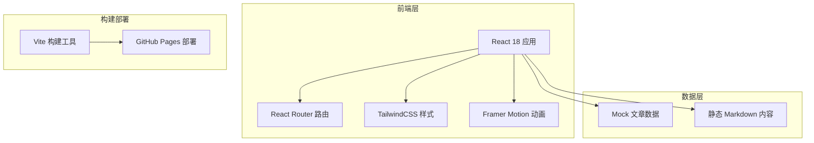

## 1. 架构设计



## 2. 技术说明

- **前端框架**：React 18 + TypeScript
- **构建工具**：Vite 5
- **样式方案**：TailwindCSS 3
- **路由管理**：React Router DOM 6
- **动画库**：Framer Motion
- **Markdown 渲染**：react-markdown + react-syntax-highlighter
- **图标库**：Lucide React
- **部署方式**：静态站点，可部署至 GitHub Pages / Vercel

## 3. 路由定义

| 路由 | 页面组件 | 用途 |
|-------|---------|------|
| `/` | HomePage | 首页 - Hero + 文章列表 + 分类筛选 |
| `/blog/:slug` | BlogDetailPage | 文章详情页 - Markdown 渲染 + 目录导航 |
| `/archive` | ArchivePage | 归档页 - 时间线文章列表 |
| `/about` | AboutPage | 关于页 - 个人介绍 + 技能 + 经历 |

## 4. 数据模型

### 4.1 文章数据结构

```typescript
interface Post {
  slug: string;
  title: string;
  description: string;
  date: string;
  readTime: number;
  tags: string[];
  category: string;
  coverImage?: string;
  content: string;
}
```

### 4.2 个人信息数据结构

```typescript
interface Profile {
  name: string;
  title: string;
  avatar: string;
  bio: string;
  social: {
    github: string;
    twitter?: string;
    email: string;
    linkedin?: string;
  };
  skills: Skill[];
  experiences: Experience[];
}

interface Skill {
  name: string;
  level: number;
  category: string;
}

interface Experience {
  company: string;
  position: string;
  period: string;
  description: string;
}
```

## 5. 目录结构

```
src/
├── components/          # 公共组件
│   ├── Layout/         # 布局组件（Header、Footer）
│   ├── PostCard/       # 文章卡片
│   ├── TagFilter/      # 标签筛选
│   ├── TableOfContents/# 目录导航
│   └── TerminalHero/   # 终端风格 Hero
├── pages/              # 页面组件
│   ├── HomePage.tsx
│   ├── BlogDetailPage.tsx
│   ├── ArchivePage.tsx
│   └── AboutPage.tsx
├── data/               # Mock 数据
│   ├── posts.ts
│   └── profile.ts
├── hooks/              # 自定义 Hooks
│   └── useScrollSpy.ts
├── styles/             # 全局样式
│   └── globals.css
├── types/              # 类型定义
│   └── index.ts
├── App.tsx
└── main.tsx
```

## 6. 核心技术点

1. **响应式布局**：基于 TailwindCSS 的断点系统，桌面优先设计
2. **滚动监听**：自定义 Hook 实现目录滚动高亮
3. **代码高亮**：react-syntax-highlighter 实现 GitHub 风格代码高亮
4. **动画效果**：Framer Motion 实现页面过渡、悬浮动效
5. **深色主题**：默认 GitHub 风格暗色主题，支持亮色切换
